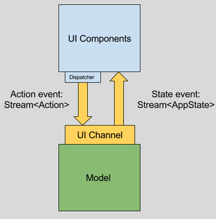

# Layered Architecture with Stream Channel, take 2.   

## Work in progress

    module/
      $module_name/ : Application module name. It's often a page in small app.
        component/ : Angular2 components and a few helpers.
        controller/ : Controller mediates between view and model with Action. 
        model/
          context/ DCI context.
            role/ DCI role in the context.
          data/ DCI data.
         actions.dart : A set of DTO representing user's intent from a component. 
         router.dart : Connect Action to Controller.
    repository/ : A repository layer.

This structure is going to be crazy for toy app, but would make sense for complex app.

## What's this

Layered by restricted communication between UI layer and
Model(Application) layer by UI Channel(Stream) with Action events and State events.

 

## Pros

- Clear boundary between UI and Model.
- Explicit unidirectional data flow.
- Explicit Model behavior.
- Model's behavior should be [tested easily](test/model_test.dart). It should be tested without Angular components and Repository.
- Also domain model should be tested easily.
- Model can be UI (and other external system such as Framework, Repository) agnostic. It is expected to work fine if an UI is replaced with NativeApp UI or ConsoleApp.

## Cons

- Overkill for small applications.
- Requires the knowledge of Stream to some extent.

The architecture overview
=========================

## Component

A component is a view and a thin controller. UI layer consists mostly of many components. 

The communication path between UI layer and Model layer is restricted through UI Channel.

* Emitting Action event by Dispatcher for mutating State at the model.
* Receiving every State event to apply to the components.

## UI Channel

UI Channel is a [Stream Channel](https://github.com/dart-lang/stream_channel) that is a singleton communication interface between UI layer and Model layer.

## Model

This is a model layer.

The architecture of this sample TODO app is based on [DCI](https://en.wikipedia.org/wiki/Data,_context_and_interaction). But any others like Flux, Redux(Reducers), DDD, CQRS will be able to apply. 

### Use Case

This is a set of Context, Role and Action.
A new Context is built with an Action, then it is invoked. (`context.call(State state) -> State`)

#### Context

In DCI context, context is a behavior of an application (what a system does).
Every context can have many Roles.

#### Action

Action is an event object defined in this layer. It will be instantiated at UI layer and passed to this layer to invoke model behavior function (Context in this example).  

### Domain

Domain is also called Data in DCI architecture (as far as I understand).
In DCI context, data is a domain knowledge (what a system is).

## References

https://vsavkin.com/managing-state-in-angular-2-applications-caf78d123d02#.d2chjf2np
https://8thlight.com/blog/uncle-bob/2012/08/13/the-clean-architecture.html
https://en.wikipedia.org/wiki/Data,_context_and_interaction

## TODO:

- Implement visibility filter UI.
- Define error states to be consumed by UI.
- Logging the state events.
- Repository integration.
- Mock server and API.
- Immutable domain and state with immutable libraries.
- Apply CQRS pattern with repository persisting data to IndexedDB and a cloud.
- Define dependencies of action streams to handle some corner cases (Dialog, Timer, etc...).
- Try to make an application(use case, domain, repository) function in WebWorker.